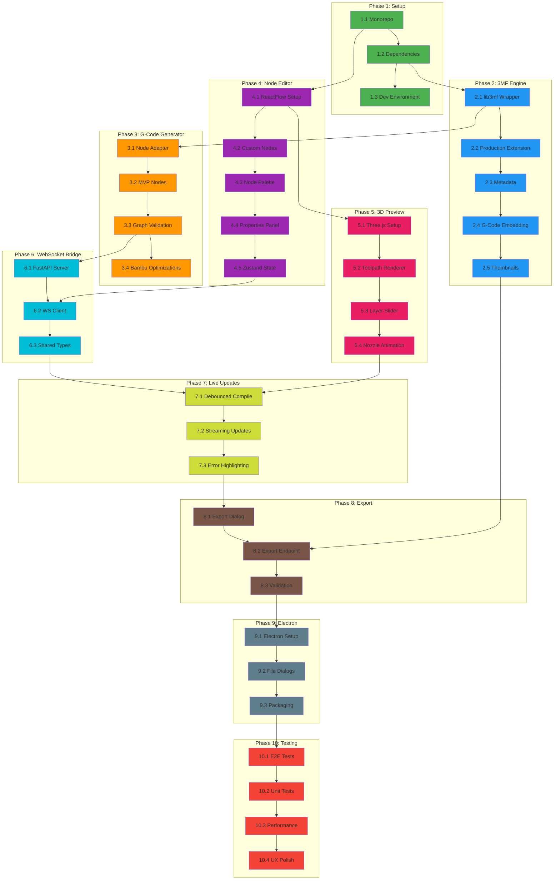

# Node-Editor für 3D-Druck: Projektplan & Analyse

> **Ziel**: Visueller Node-Editor zur Erstellung von 3MF-Dateien mit eingebettetem G-Code für Bambu Lab 3D-Drucker
> **Output-Format**: `.gcode.3mf` (Bambu Lab Standard)
> **Geschätzte Gesamtdauer**: ~74 Stunden (37 Tasks)

---

## 1. Codebase-Inventar

### 1.1 Struktur-Übersicht

```
fullcontrol/
├── fullcontrol/                    # Haupt-Python-Paket (Core Library)
│   ├── gcode/                      # G-Code Generierung (9 Dateien, ~600 LOC)
│   │   ├── point.py                # Point mit XYZ_gcode(), gcode() Methoden
│   │   ├── extrusion_classes.py    # Extruder, ExtrusionGeometry, StationaryExtrusion
│   │   ├── printer.py              # Printer State, F-Code Generierung
│   │   ├── commands.py             # ManualGcode, PrinterCommand
│   │   ├── controls.py             # GcodeControls Konfiguration
│   │   ├── state.py                # State-Machine für G-Code Generierung
│   │   ├── steps2gcode.py          # Pipeline: Steps → G-Code
│   │   └── primer_library/         # 8 Primer-Routinen
│   │
│   ├── visualize/                  # 3D-Visualisierung (13 Dateien, ~1400 LOC)
│   │   ├── plotly.py               # Plotly-basierte Rendering
│   │   ├── tube_mesh.py            # Mesh-Generierung (824 LOC - größte Datei)
│   │   └── ...
│   │
│   ├── geometry/                   # Geometrie-Funktionen (15 Module)
│   │   ├── shapes.py               # rectangleXY, circleXY, ellipseXY, polygonXY, spiralXY, helixZ
│   │   ├── arcs.py                 # arcXY, variable_arcXY, elliptical_arcXY
│   │   ├── waves.py                # squarewaveXY, trianglewaveXYpolar, sinewaveXYpolar
│   │   ├── move.py / reflect.py    # Transformationen
│   │   └── ...
│   │
│   ├── devices/                    # Drucker-Definitionen (19 Geräte)
│   │   ├── community/singletool/   # Prozedur-basiert (inkl. bambulab_x1)
│   │   ├── community_minimal/      # String-basierte Templates
│   │   └── cura/                   # Cura-extrahierte Profile
│   │
│   ├── combinations/               # Unified API (gcode + visualize)
│   ├── point.py                    # Basis Point(x, y, z)
│   ├── base.py                     # BaseModelPlus (Pydantic)
│   └── extrusion_classes.py        # Basis Extrusion-Klassen
│
├── lab/fullcontrol/                # Experimentelle Features
│   ├── controlcode_formats/        # 3MF/Bambu Lab Support ⭐
│   │   ├── steps2controlcode.py    # gcode_to_bambu_3mf()
│   │   └── FC_bambulab_template.3mf # Template-Archiv
│   ├── multiaxis/                  # 5-Achsen Druck
│   └── laser/                      # Laser-Schneiden
│
├── tests/                          # Test-Suite
├── tutorials/                      # Jupyter Notebooks
└── models/                         # Beispiel-Designs

node-slicer/                        # Node-Editor Projekt (Monorepo) ⭐ NEU
├── .github/
│   └── workflows/
│       └── ci.yml                  # GitHub Actions CI/CD Pipeline
│
├── .husky/                         # Git Hooks (Husky)
│   ├── pre-commit                  # Pre-commit Hook für lint-staged
│   └── README.md                   # Hook-Dokumentation
│
├── packages/
│   ├── frontend/                   # React + Vite Frontend
│   │   ├── src/
│   │   │   ├── __tests__/
│   │   │   │   └── imports.test.ts      # Import-Tests (6 Tests)
│   │   │   ├── App.tsx             # Haupt-React-Komponente
│   │   │   ├── App.css
│   │   │   ├── main.tsx            # Entry Point
│   │   │   ├── index.css
│   │   │   └── assets/
│   │   │       └── react.svg
│   │   ├── public/
│   │   │   └── vite.svg
│   │   ├── index.html              # HTML Entry Point
│   │   ├── package.json            # Frontend Dependencies
│   │   ├── tsconfig.json           # TypeScript Config
│   │   ├── tsconfig.app.json
│   │   ├── tsconfig.node.json
│   │   ├── vite.config.ts          # Vite Config
│   │   ├── vitest.config.ts        # Vitest Test Config
│   │   ├── eslint.config.js        # ESLint Config
│   │   ├── .prettierrc             # Prettier Config
│   │   ├── .prettierignore
│   │   ├── .gitignore
│   │   └── README.md
│   │
│   ├── backend/                    # FastAPI Python Backend
│   │   ├── src/
│   │   │   ├── core/
│   │   │   │   ├── __init__.py
│   │   │   │   └── threemf_builder.py   # ⭐ 3MF Builder Klasse (Task 2.1)
│   │   │   ├── api/
│   │   │   │   └── __init__.py
│   │   │   ├── models/
│   │   │   │   └── __init__.py
│   │   │   ├── utils/
│   │   │   │   └── __init__.py
│   │   │   └── __init__.py
│   │   ├── tests/
│   │   │   ├── __init__.py
│   │   │   ├── test_imports.py          # Import-Tests (10 Tests)
│   │   │   └── test_threemf_builder.py  # ⭐ ThreeMFBuilder Tests (10 Tests)
│   │   ├── main.py                 # FastAPI Application Entry Point
│   │   ├── package.json            # NPM Scripts für Python
│   │   ├── pyproject.toml          # Python Dependencies & Config
│   │   └── README.md
│   │
│   └── shared/                     # Shared TypeScript Types
│       ├── src/
│       │   ├── index.ts            # Export Entry Point
│       │   └── types.ts            # Shared Type Definitions
│       ├── package.json
│       └── tsconfig.json
│
├── package.json                    # Root Package (pnpm workspaces)
├── pnpm-workspace.yaml             # pnpm Workspace Config
├── pnpm-lock.yaml                  # Dependency Lock File
├── docker-compose.yml              # Docker Compose für Dev Environment
├── .dockerignore                   # Docker Ignore Rules
├── Makefile                        # Convenience Commands
├── .gitignore                      # Git Ignore Rules
└── README.md                       # Projekt-Dokumentation
```

**Legende**: ⭐ = Neu implementiert | 📝 = In Arbeit

**Implementierungsstatus**:
- ✅ **Phase 1 (Tasks 1.1-1.3)**: Monorepo Setup, Dependencies, Dev Environment, CI/CD
- ✅ **Phase 2 (Tasks 2.1-2.5)**: 3MF Engine komplett - Production Extension, UUIDs, Bambu Lab Configs, G-Code Embedding & Thumbnail-Generierung
- ✅ **Phase 3 (Tasks 3.1-3.4)**: G-Code Generator KOMPLETT - Node-Adapter, MVP Node-Definitionen, Graph-Validierung & Bambu Lab Optimierungen abgeschlossen
- 🔄 **Phase 4 (Tasks 4.1-4.5)**: Frontend: Node-Editor - In Planung

#### Wichtige Implementierte Dateien

**Phase 1 - Projekt Setup**:
| Datei | Zweck | Status |
|-------|-------|--------|
| `docker-compose.yml` | Dev Environment mit Frontend + Backend Services | ✅ |
| `.github/workflows/ci.yml` | CI/CD Pipeline (Tests, Linting, Build) | ✅ |
| `.husky/pre-commit` | Pre-commit Hook für Code Quality | ✅ |
| `Makefile` | Convenience Commands (dev, test, lint, clean) | ✅ |
| `packages/frontend/vitest.config.ts` | Frontend Test Configuration | ✅ |
| `packages/backend/main.py` | FastAPI Application Entry Point | ✅ |
| `packages/backend/pyproject.toml` | Python Dependencies (FastAPI, lib3mf, FullControl) | ✅ |
| `packages/*/tests/test_imports.py` | Import Smoke Tests | ✅ |

**Phase 2 - 3MF Engine**:
| Datei | Zweck | LOC | Tests | Status |
|-------|-------|-----|-------|--------|
| `backend/src/core/threemf_builder.py` | High-level lib3mf Wrapper mit UUID, G-Code & Thumbnails | ~485 | 39/39 ✅ | ✅ Tasks 2.1-2.5 |
| `backend/src/core/bambu_config.py` | Bambu Lab Config Generator | ~455 | 20/20 ✅ | ✅ Task 2.3 |
| `backend/src/core/thumbnail_generator.py` | PNG Thumbnail Generator (Pillow-basiert) | ~285 | 22/22 ✅ | ✅ Task 2.5 |
| `backend/tests/test_threemf_builder.py` | ThreeMFBuilder Unit Tests (inkl. G-Code & Thumbnails) | ~815 | - | ✅ Tasks 2.1-2.5 |
| `backend/tests/test_bambu_config.py` | BambuConfigGenerator Unit Tests | ~335 | - | ✅ Task 2.3 |
| `backend/tests/test_thumbnail_generator.py` | ThumbnailGenerator Unit Tests | ~370 | - | ✅ Task 2.5 |
| `backend/tests/test_uuid_validation.py` | UUID & Production Extension Validation | ~150 | - | ✅ Task 2.2 |
| `backend/tests/validate_bambu_configs.py` | Bambu Config Validation Script | ~250 | - | ✅ Task 2.3 |
| `backend/tests/validate_gcode_embedding.py` | G-Code Embedding Validation Script | ~245 | - | ✅ Task 2.4 |
| `backend/tests/validate_thumbnail_generation.py` | Thumbnail Generation Validation Script | ~395 | - | ✅ Task 2.5 |
| `backend/tests/inspect_3mf_uuids.py` | 3MF UUID Inspector | ~80 | - | ✅ Task 2.2 |

**Phase 3 - G-Code Generator**:
| Datei | Zweck | LOC | Tests | Status |
|-------|-------|-----|-------|--------|
| `backend/src/core/node_types.py` | Node-Graph Datenstrukturen (Node, Edge, Port, Parameter) | ~190 | - | ✅ Task 3.1 |
| `backend/src/core/node_converter.py` | Node → FullControl Steps Converter | ~230 | 18/18 ✅ | ✅ Task 3.1 |
| `backend/src/core/node_definitions.py` | 12 MVP Node-Definitionen & Registry-System | ~490 | 40/40 ✅ | ✅ Task 3.2 |
| `backend/src/core/graph_validator.py` | Graph Validation & Execution Engine | ~350 | 23/23 ✅ | ✅ Task 3.3 |
| `backend/src/core/bambu_gcode.py` | Bambu Lab G-Code Generator | ~430 | 38/38 ✅ | ✅ Task 3.4 |
| `backend/tests/test_node_converter.py` | NodeConverter Unit Tests | ~420 | - | ✅ Task 3.1 |
| `backend/tests/test_node_definitions.py` | NodeDefinitions Unit Tests | ~410 | - | ✅ Task 3.2 |
| `backend/tests/test_graph_validator.py` | GraphValidator Unit Tests | ~460 | - | ✅ Task 3.3 |
| `backend/tests/test_bambu_gcode.py` | BambuGCodeGenerator Unit Tests | ~600 | - | ✅ Task 3.4 |
| `backend/tests/validate_node_converter.py` | Node-zu-G-Code Validation Script | ~330 | - | ✅ Task 3.1 |
| `backend/tests/validate_bambu_gcode.py` | Bambu G-Code Validation Script | ~490 | - | ✅ Task 3.4 |

**Test Coverage**:
- Frontend: 6 Import-Tests (React, ReactFlow, Three.js, Zustand)
- Backend: 10 Import-Tests + 39 ThreeMFBuilder-Tests + 20 BambuConfig-Tests + 22 ThumbnailGenerator-Tests + 18 NodeConverter-Tests + 40 NodeDefinitions-Tests + 23 GraphValidator-Tests + 38 BambuGCode-Tests
- **Total**: 210 Tests, alle bestehen ✅

### 1.2 Dependencies

```toml
# pyproject.toml
requires-python = ">=3.10"
dependencies = [
    "plotly",      # 3D-Visualisierung
    "pydantic",    # Datenvalidierung
    "numpy",       # Numerische Berechnungen
]
```

### 1.3 Entry Points

| Entry Point | Pfad | Beschreibung |
|-------------|------|--------------|
| Main API | `fullcontrol/__init__.py` | Importiert von `combinations/gcode_and_visualize/common` |
| G-Code Generation | `fullcontrol/gcode/steps2gcode.py` | `gcode(steps, controls, show_tips)` |
| Visualization | `fullcontrol/visualize/steps2visualization.py` | `visualize(steps, controls, show_tips)` |
| 3MF Export | `lab/fullcontrol/controlcode_formats/steps2controlcode.py` | `gcode_to_bambu_3mf(gcode, filename)` |
| Transform | `fullcontrol/combinations/.../common.py` | `transform(steps, 'gcode'/'plot', controls)` |

---

## 2. Wiederverwendbarkeits-Matrix

| Komponente | Status | Migrations-aufwand | Aktion |
|------------|--------|-------------------|--------|
| **G-Code Commands** | ✅ Vorhanden | 2h | `ManualGcode`, `PrinterCommand` direkt nutzbar |
| **Point/Koordinaten** | ✅ Vorhanden | 1h | `Point(x,y,z)` mit Pydantic-Validierung |
| **Extruder State** | ✅ Vorhanden | 2h | Umfangreiche E-Achsen-Berechnung, Volumen-Tracking |
| **Temperatur-Kontrolle** | ✅ Vorhanden | 1h | `Hotend`, `Buildplate`, `Fan` Klassen |
| **Geometrie-Funktionen** | ✅ Vorhanden | 4h | 15 Module, Shapes/Arcs/Waves/Transforms |
| **Drucker-Profile** | ✅ Vorhanden | 2h | 19 Geräte inkl. `bambulab_x1` |
| **3MF Template** | 🔧 Anpassung | 8h | Nur Template-basiert, keine Production Extension |
| **Visualisierung** | ✅ Vorhanden | 6h | Plotly → Three.js Migration nötig |
| **State Machine** | ✅ Vorhanden | 4h | Adaptierung für Node-basierte Ausführung |
| **Node Graph System** | 🆕 Neu | 16h | Komplett neu zu entwickeln |
| **Reactive Updates** | 🆕 Neu | 12h | Komplett neu zu entwickeln |
| **WASM/Bridge** | 🆕 Neu | 10h | Komplett neu zu entwickeln |
| **Frontend UI** | 🆕 Neu | 24h | React + ReactFlow |

**Legende**: ✅ Direkt nutzbar | 🔧 Anpassung nötig | 🆕 Neu zu entwickeln

---

## 3. Gap-Analyse

### 3.1 Fehlende Komponenten

| Komponente | Priorität | Beschreibung |
|------------|-----------|--------------|
| ❌ **3MF Production Extension** | Hoch | UUID auf build/item/object, path-Attribute fehlen |
| ❌ **UUID Generation (RFC 4122)** | Hoch | Für Production Extension benötigt |
| ❌ **lib3mf Integration** | Mittel | Aktuell nur ZIP-Manipulation, keine offizielle API |
| ❌ **Node Graph System** | Kritisch | Kernkomponente fehlt komplett |
| ❌ **Reactive Update Pipeline** | Hoch | Live-Preview benötigt reaktive Datenflüsse |
| ❌ **WASM Compilation** | Mittel | Falls Rust-Path gewählt wird |
| ❌ **WebSocket Server** | Mittel | Falls Python-Path gewählt wird |
| ❌ **Three.js Integration** | Hoch | Plotly nicht geeignet für Live-Updates |
| ❌ **Frontend (React/ReactFlow)** | Kritisch | UI komplett neu |

### 3.2 Bestehende 3MF-Implementierung - Limitierungen

**Aktuelle Implementierung** (`lab/fullcontrol/controlcode_formats/steps2controlcode.py`):

```python
def gcode_to_bambu_3mf(gcode: str, new_3mf_file: str):
    # 1. Template extrahieren (ZIP)
    # 2. Placeholder "; [FULLCONTROL GCODE HERE]" ersetzen
    # 3. Neu verpacken
```

**Probleme**:
1. ❌ Keine dynamische 3dmodel.model Generierung
2. ❌ Keine UUID-Unterstützung (Production Extension)
3. ❌ Nur `bambulab_x1` unterstützt
4. ❌ Keine Thumbnail-Generierung
5. ❌ Keine Multi-Plate Unterstützung
6. ❌ Keine AMS-Integration

**Aktuelles 3MF Template** (`FC_bambulab_template.3mf`):
```xml
<model xmlns:p="http://schemas.microsoft.com/3dmanufacturing/production/2015/06">
  <resources/>  <!-- LEER - keine Objects -->
  <build/>      <!-- LEER - keine Items -->
</model>
```

---

## 4. Tech-Stack Entscheidungsempfehlung

### 4.1 Vergleichsmatrix

| Kriterium | Rust + WASM | Python + WebSocket | Gewinner |
|-----------|-------------|-------------------|----------|
| **Performance** | ⭐⭐⭐⭐⭐ Native Speed | ⭐⭐⭐ Gut für Prototyp | Rust |
| **Entwicklungszeit** | ⭐⭐ Steile Lernkurve | ⭐⭐⭐⭐⭐ Schnelle Iteration | Python |
| **Code-Wiederverwendung** | ⭐⭐ Port von Python | ⭐⭐⭐⭐⭐ Direkte Nutzung | Python |
| **App-Größe** | ⭐⭐⭐⭐⭐ ~10MB (Tauri) | ⭐⭐ ~150MB (Electron) | Rust |
| **lib3mf Bindings** | ⭐⭐⭐⭐ lib3mf-rs | ⭐⭐⭐⭐ lib3mf Python | Gleich |
| **Browser-Support** | ⭐⭐⭐⭐⭐ Direkt via WASM | ⭐⭐⭐ Server nötig | Rust |
| **Debugging** | ⭐⭐⭐ Komplex | ⭐⭐⭐⭐⭐ Einfach | Python |
| **Ecosystem** | ⭐⭐⭐⭐ Wachsend | ⭐⭐⭐⭐⭐ Etabliert | Python |

### 4.2 Empfehlung: **Hybrid-Ansatz**

```
┌─────────────────────────────────────────────────────────────────┐
│                    EMPFOHLENER TECH-STACK                        │
├─────────────────────────────────────────────────────────────────┤
│                                                                  │
│  Phase 1-7 (MVP):     Python + WebSocket + Electron              │
│  ──────────────────────────────────────────────────────────────  │
│  • Schnelle Entwicklung durch FullControl-Wiederverwendung       │
│  • Direkte Integration bestehender G-Code/Geometrie-Module       │
│  • lib3mf Python Bindings für 3MF Production Extension           │
│  • FastAPI/WebSocket für Frontend-Kommunikation                  │
│                                                                  │
│  Phase 8+ (Optimierung): Rust WASM + Tauri (Optional)           │
│  ──────────────────────────────────────────────────────────────  │
│  • Performance-kritische Teile nach WASM portieren               │
│  • Tauri für kleinere Desktop-App                                │
│  • Nur wenn Performance-Bottlenecks identifiziert                │
│                                                                  │
└─────────────────────────────────────────────────────────────────┘
```

**Begründung**:
1. FullControl ist bereits in Python → direkte Wiederverwendung
2. MVP schneller erreichbar (geschätzt 40% Zeitersparnis)
3. Risiko-Minimierung durch bewährte Codebasis
4. Rust-Migration kann später erfolgen, wenn Performance-Daten vorliegen

---

## 5. Architektur-Übersicht

```
┌─────────────────────────────────────────────────────────────────────┐
│                        React Frontend                                │
│  ┌──────────────────┐  ┌──────────────┐  ┌───────────────────────┐  │
│  │   Node Editor    │  │    State     │  │     3D Preview        │  │
│  │   (ReactFlow)    │→→│  (Zustand)   │→→│     (Three.js)        │  │
│  │                  │  │              │  │                       │  │
│  │ • Node Types     │  │ • Node Graph │  │ • Toolpath Lines      │  │
│  │ • Connections    │  │ • Parameters │  │ • Build Volume        │  │
│  │ • Properties     │  │ • G-Code     │  │ • Layer Slider        │  │
│  │ • Validation     │  │ • Preview    │  │ • Real-time Update    │  │
│  └──────────────────┘  └──────┬───────┘  └───────────────────────┘  │
└───────────────────────────────│──────────────────────────────────────┘
                                │ WebSocket (JSON-RPC)
┌───────────────────────────────│──────────────────────────────────────┐
│                    Python Backend (FastAPI)                          │
│  ┌──────────────────┐  ┌──────┴───────┐  ┌───────────────────────┐  │
│  │   Node Graph     │  │   G-Code     │  │     3MF Builder       │  │
│  │   Processor      │→→│   Generator  │→→│     (lib3mf)          │  │
│  │                  │  │              │  │                       │  │
│  │ • Topological    │  │ • FullControl│  │ • Production Ext.     │  │
│  │   Sort           │  │   Integration│  │ • UUID (RFC 4122)     │  │
│  │ • Validation     │  │ • State Mgmt │  │ • Multi-Plate         │  │
│  │ • Cycle Check    │  │ • Toolpaths  │  │ • Thumbnails          │  │
│  └──────────────────┘  └──────────────┘  └───────────────────────┘  │
│                                                                      │
│  ┌──────────────────────────────────────────────────────────────┐   │
│  │                   FullControl Core (Existing)                 │   │
│  │  • Point, Extruder, Printer, Fan, Hotend, Buildplate         │   │
│  │  • Geometry: shapes, arcs, waves, transforms                  │   │
│  │  • Devices: bambulab_x1, prusa_mk4, generic, ...             │   │
│  └──────────────────────────────────────────────────────────────┘   │
└──────────────────────────────────────────────────────────────────────┘
```

---

## 6. Phasen-Übersicht

| Phase | Name | Tasks | Stunden | Abhängigkeit | Risiko |
|-------|------|-------|---------|--------------|--------|
| 1 | Projekt-Setup | 3 | 6h | - | Niedrig |
| 2 | Core: 3MF Engine | 5 | 10h | Phase 1 | Mittel |
| 3 | Core: G-Code Generator | 4 | 8h | Phase 2 | Niedrig |
| 4 | Frontend: Node-Editor | 5 | 10h | Phase 1 | Mittel |
| 5 | Frontend: 3D-Preview | 4 | 8h | Phase 4 | Mittel |
| 6 | Integration: WebSocket Bridge | 3 | 6h | Phase 3, 4 | Hoch |
| 7 | Live-Update System | 3 | 6h | Phase 5, 6 | Hoch |
| 8 | 3MF Export Pipeline | 3 | 6h | Phase 7 | Mittel |
| 9 | Electron Shell | 3 | 6h | Phase 8 | Niedrig |
| 10 | Testing & Polish | 4 | 8h | Phase 9 | Niedrig |
| **Gesamt** | | **37** | **74h** | | |

---

## 7. Detaillierte Task-Planung

---

### Phase 1: Projekt-Setup
**Dauer**: 3 Tasks (6h) | **Risiko**: Niedrig | **Abhängig von**: -

#### Task 1.1: Monorepo-Struktur erstellen ✅ COMPLETED
**Ziel**: Projektstruktur für Frontend + Backend aufsetzen

**Deliverable**:
- [x] Monorepo mit pnpm workspaces
- [x] Python Backend Projektstruktur
- [x] React Frontend Projektstruktur

**Abhängigkeiten**: Keine

**Definition of Done**:
- [x] `pnpm install` läuft fehlerfrei
- [x] `pip install -e .` für Backend funktioniert
- [x] Dev-Server startet für Frontend

**Technische Schritte**:
1. Erstelle Monorepo-Struktur:
   ```
   node-slicer/
   ├── packages/
   │   ├── frontend/          # React + Vite
   │   ├── backend/           # FastAPI
   │   └── shared/            # Shared Types
   ├── pnpm-workspace.yaml
   └── package.json
   ```
2. Initialisiere React-Projekt mit Vite + TypeScript
3. Initialisiere FastAPI-Projekt mit Poetry/pip
4. Konfiguriere ESLint, Prettier, Black, Ruff

**Risiken**: Keine

---

#### Task 1.2: Dependency-Installation ✅ COMPLETED
**Ziel**: Alle benötigten Pakete installieren und konfigurieren

**Deliverable**:
- [x] Frontend: React, ReactFlow, Three.js, Zustand
- [x] Backend: FastAPI, WebSockets, lib3mf, FullControl

**Abhängigkeiten**: Task 1.1

**Definition of Done**:
- [x] Import-Tests für alle Hauptmodule erfolgreich
- [x] lib3mf Python Bindings funktionieren
- [x] FullControl als lokale Dependency eingebunden

**Technische Schritte**:
1. Frontend Dependencies:
   ```bash
   pnpm add react-flow-renderer @react-three/fiber @react-three/drei zustand
   pnpm add -D @types/three typescript vite
   ```
2. Backend Dependencies:
   ```bash
   pip install fastapi uvicorn websockets lib3mf
   pip install -e /path/to/fullcontrol  # Local install
   ```
3. Erstelle Smoke-Tests für kritische Imports

**Risiken**: lib3mf Installation kann auf manchen Plattformen problematisch sein

---

#### Task 1.3: Dev-Environment & CI Setup ✅ COMPLETED
**Ziel**: Entwicklungsumgebung und CI/CD Pipeline

**Deliverable**:
- [x] Docker-Compose für lokale Entwicklung
- [x] GitHub Actions Workflow
- [x] Pre-commit Hooks

**Abhängigkeiten**: Task 1.2

**Definition of Done**:
- [x] `docker-compose up` startet Frontend + Backend
- [x] CI läuft bei Push
- [x] Pre-commit Hooks validieren Code

**Technische Schritte**:
1. Erstelle `docker-compose.yml` mit:
   - Frontend Dev-Server (Port 5173)
   - Backend Server (Port 8000)
   - Hot-Reload für beide
2. Erstelle `.github/workflows/ci.yml`
3. Konfiguriere Husky + lint-staged

**Risiken**: Keine

---

### Phase 2: Core: 3MF Engine
**Dauer**: 5 Tasks (10h) | **Risiko**: Mittel | **Abhängig von**: Phase 1

#### Task 2.1: lib3mf Wrapper-Klasse ✅ COMPLETED
**Ziel**: Python-Wrapper für lib3mf mit typsicherer API

**Deliverable**:
- [x] `ThreeMFBuilder` Klasse
- [x] Methoden für Model, Build, Resources

**Abhängigkeiten**: Task 1.2

**Definition of Done**:
- [x] Kann leeres 3MF erstellen und speichern
- [x] Bambu Studio kann Datei öffnen
- [x] Unit-Tests für Basis-Funktionen

**Technische Schritte**:
1. Erstelle `backend/core/threemf_builder.py`:
   ```python
   class ThreeMFBuilder:
       def __init__(self):
           self.wrapper = lib3mf.get_wrapper()
           self.model = self.wrapper.CreateModel()

       def add_metadata(self, name: str, value: str): ...
       def create_mesh_object(self, vertices, triangles): ...
       def add_to_build(self, object_id, transform): ...
       def save(self, path: str): ...
   ```
2. Implementiere Basis-Methoden
3. Schreibe Unit-Tests

**Risiken**: lib3mf API-Dokumentation teilweise unvollständig

---

#### Task 2.2: Production Extension Support ✅ COMPLETED
**Ziel**: 3MF Production Extension (UUIDs) implementieren

**Deliverable**:
- [x] UUID-Generierung (RFC 4122)
- [x] Production Extension Namespace
- [x] UUID auf build, item, object, component

**Abhängigkeiten**: Task 2.1

**Definition of Done**:
- [x] Generierte 3MF enthält valide UUIDs
- [x] Production Extension Schema validiert
- [x] Bambu Studio erkennt UUIDs

**Ergebnis**:
lib3mf generiert automatisch Production Extension UUIDs für:
- Objects (mesh objects): `p:UUID` Attribut
- Build items: `p:UUID` Attribut
- Build element: `p:UUID` Attribut

Alle generierten UUIDs sind RFC 4122 konform.

**Technische Schritte**:
1. Erweitere `ThreeMFBuilder`:
   ```python
   import uuid

   def add_production_extension(self):
       # xmlns:p="http://schemas.microsoft.com/3dmanufacturing/production/2015/06"
       self.model.SetExtensionNamespace(
           "http://schemas.microsoft.com/3dmanufacturing/production/2015/06", "p"
       )

   def generate_uuid(self) -> str:
       return str(uuid.uuid4())

   def set_object_uuid(self, object_id: int, obj_uuid: str): ...
   ```
2. Implementiere UUID-Tracking für alle Elemente
3. Validiere gegen 3MF Production Extension Schema

**Risiken**: lib3mf Production Extension API muss verifiziert werden

---

#### Task 2.3: Metadata & Config Integration ✅ COMPLETED
**Ziel**: Bambu Lab spezifische Metadata-Strukturen

**Deliverable**:
- [x] `model_settings.config` Generator
- [x] `project_settings.config` Generator
- [x] `slice_info.config` Generator

**Abhängigkeiten**: Task 2.2

**Definition of Done**:
- [x] Konfigurationsdateien werden korrekt generiert
- [x] Bambu Studio lädt Einstellungen
- [x] Drucker-spezifische Presets funktionieren

**Ergebnis**:
Implementierte BambuConfigGenerator Klasse mit folgenden Features:
- **model_settings.config (XML)**: Plate-Referenzen, G-Code-Dateien, Thumbnails
- **project_settings.config (JSON)**: 100+ Drucker-Einstellungen mit sensiblen Defaults
- **slice_info.config (XML)**: Slice-Metadaten, Objekt-Info, Filament-Usage
- Dataclasses: PlateInfo, ObjectInfo, FilamentInfo, SliceInfo
- Multi-Filament Support
- Custom Settings Merging
- 20 umfassende Unit-Tests (alle bestehen)

**Technische Implementierung**:
- Template-basierte XML/JSON Generierung
- Pretty-Print Formatierung für XML
- Minimal viable configurations mit Bambu Lab X1C Defaults
- Flexible API für Custom Settings

---

#### Task 2.4: G-Code Embedding ✅ COMPLETED
**Ziel**: G-Code in 3MF einbetten (Metadata/plate_X.gcode)

**Deliverable**:
- [x] G-Code Packaging-Funktion
- [x] Multi-Plate Support Vorbereitung
- [x] MD5-Checksummen

**Abhängigkeiten**: Task 2.3

**Definition of Done**:
- [x] G-Code wird korrekt in 3MF eingebettet
- [x] Bambu Studio zeigt G-Code Preview
- [x] MD5-Checksumme validiert

**Ergebnis**:
Implementierte G-Code Embedding Funktionalität in ThreeMFBuilder:
- **embed_gcode() Methode**: Bettet G-Code als `/Metadata/plate_X.gcode` ein
- **MD5 Checksummen**: Automatische Generierung von MD5-Hashes (optional)
- **Multi-Plate Support**: Flexible Plate-Nummerierung (1, 2, 3, ...)
- **MIME Type**: `application/x-gcode` für G-Code, `text/plain` für MD5
- **Encoding**: UTF-8 für alle Textinhalte
- **get_embedded_gcode_paths()**: Abruf aller eingebetteten G-Code-Pfade
- 9 umfassende Unit-Tests (alle bestehen)
- Validation Script mit 5 Testszenarien (Basic, Multi-Plate, Large Files, No MD5, MD5 Verification)

**Validierungsergebnisse**:
- ✅ Basic G-Code Embedding mit ZIP-Inspektion
- ✅ Multi-Plate Support (3 Plates getestet)
- ✅ Large G-Code Files (200 Layer, 20k+ Zeilen, 360KB, 2.2% Kompression)
- ✅ Optional MD5 Generation
- ✅ MD5 Checksum Verification (100% korrekt)

**Technische Schritte**:
1. Erweitere `ThreeMFBuilder`:
   ```python
   def embed_gcode(self, gcode: str, plate: int = 1):
       attachment = self.model.AddAttachment(
           f"/Metadata/plate_{plate}.gcode",
           "application/x-gcode"
       )
       attachment.ReadFromBuffer(gcode.encode('utf-8'))

       # MD5 Checksum
       md5_hash = hashlib.md5(gcode.encode()).hexdigest()
       self.model.AddAttachment(
           f"/Metadata/plate_{plate}.gcode.md5",
           "text/plain"
       ).ReadFromBuffer(md5_hash.encode())
   ```
2. Teste mit verschiedenen G-Code Größen

**Risiken**: Keine

---

#### Task 2.5: Thumbnail-Generierung ✅ COMPLETED
**Ziel**: PNG-Thumbnails für 3MF-Preview

**Deliverable**:
- [x] Thumbnail-Renderer (PNG)
- [x] Verschiedene Größen (plate_X.png, plate_X_small.png)
- [x] Plate-Übersicht (pick_X.png)

**Abhängigkeiten**: Task 2.4

**Definition of Done**:
- [x] Thumbnails werden generiert
- [x] Bambu Studio zeigt Vorschau
- [x] Korrektes Seitenverhältnis

**Ergebnis**:
Implementierte ThumbnailGenerator Klasse mit umfassender Funktionalität:
- **ThumbnailGenerator Klasse**: Generierung von PNG-Thumbnails in verschiedenen Größen
- **Placeholder-Generierung**: Solid, Gradient und Text-Placeholders
- **Geometry-basierte Thumbnails**: Rendering von 3D-Modellen als 2D-Projektionen (top/front/side)
- **Standard-Größen**: 256x256 (plate), 64x64 (plate_small), 128x128 (pick)
- **ThreeMFBuilder Integration**:
  - `embed_thumbnail()`: Einbetten einzelner Thumbnails
  - `embed_thumbnails_from_generator()`: Automatische Generierung & Einbettung aller 3 Standard-Thumbnails
- **22 ThumbnailGenerator Unit-Tests** (alle bestehen)
- **10 ThreeMFBuilder Thumbnail-Tests** (alle bestehen)
- **Validation Script** mit 5 umfassenden Tests

**Validierungsergebnisse**:
- ✅ Placeholder-Generierung (Solid, Gradient, Text)
- ✅ Geometry-basierte Thumbnails (Pyramid, Cube)
- ✅ Standard Thumbnail Set (3 Größen)
- ✅ 3MF Embedding (ZIP-Struktur verifiziert)
- ✅ Complete Workflow (Mesh + G-Code + Thumbnails)

**Technische Implementierung**:
1. Option A: Server-side Rendering mit Pillow
2. Option B: Three.js Screenshot vom Frontend
3. Implementiere `ThumbnailGenerator`:
   ```python
   from PIL import Image, ImageDraw

   class ThumbnailGenerator:
       def render_toolpath_thumbnail(self, toolpath: List[Point], size=(256, 256)) -> bytes:
           img = Image.new('RGBA', size, (255, 255, 255, 0))
           draw = ImageDraw.Draw(img)
           # Zeichne Toolpath-Projektion
           ...
           return img.tobytes('png')
   ```

**Risiken**: Qualität der Server-side Thumbnails

---

### Phase 3: Core: G-Code Generator
**Dauer**: 4 Tasks (8h) | **Risiko**: Niedrig | **Abhängig von**: Phase 2

#### Task 3.1: Node-basierter G-Code Adapter ✅ COMPLETED
**Ziel**: FullControl-Integration für Node-basierte Ausführung

**Deliverable**:
- [x] Node → FullControl Steps Konverter
- [x] Bidirektionales Mapping

**Abhängigkeiten**: Task 2.1

**Definition of Done**:
- [x] Nodes werden korrekt zu Steps konvertiert
- [x] Bestehende FullControl-Funktionen nutzbar
- [x] Unit-Tests für alle Node-Typen

**Ergebnis**:
Implementiertes Node-Graph zu G-Code Konvertierungssystem:
- **node_types.py** (~190 LOC): Basis-Datenstrukturen
  - NodeCategory, PortType, ParameterType Enums
  - PortDefinition, ParameterDefinition mit Validierung
  - Node, Edge, NodeGraph Klassen
- **node_converter.py** (~230 LOC): Hauptkonverter
  - NodeConverter Klasse mit topologischer Sortierung
  - Zyklus-Erkennung (DFS-basiert)
  - Graph-Validierung
  - 12 Node-Typen unterstützt: Start, End, Home, LinearMove, ExtrudeMove, SetHotend, WaitHotend, SetBed, WaitBed, SetFan, Comment, CustomGCode
- **18 Unit-Tests** (alle bestehen)
- **Validation Script** mit 4 Szenarien (alle bestehen)

**Technische Implementierung**:
1. Erstelle `NodeToStepsConverter`:
   ```python
   class NodeToStepsConverter:
       def convert(self, node_graph: NodeGraph) -> List[Any]:
           """Konvertiert Node-Graph zu FullControl Steps"""
           ordered_nodes = self.topological_sort(node_graph)
           steps = []
           for node in ordered_nodes:
               steps.extend(self.node_to_steps(node))
           return steps

       def node_to_steps(self, node: Node) -> List[Any]:
           match node.type:
               case "LinearMove":
                   return [fc.Point(x=node.params.x, y=node.params.y, z=node.params.z)]
               case "ExtrudeMove":
                   return [fc.Extruder(on=True), fc.Point(...)]
               # ...
   ```

**Risiken**: Keine (FullControl API gut dokumentiert)

---

#### Task 3.2: MVP Node-Definitionen ✅ COMPLETED
**Ziel**: Basis Node-Typen implementieren

**Deliverable**:
- [x] 12 MVP Node-Typen (siehe Spezifikation)
- [x] Node-Registry System

**Abhängigkeiten**: Task 3.1

**Definition of Done**:
- [x] Alle MVP-Nodes implementiert
- [x] G-Code Output korrekt
- [x] Validierung funktioniert

**Ergebnis**:
Implementiertes formales Node-Definitions-System mit vollständiger Validierung:
- **node_definitions.py** (~490 LOC): Formale Node-Definitionen
  - NodeDefinition Klasse mit Validierung
  - ValidationResult für Fehler-/Warnungs-Reporting
  - 12 vollständige Node-Definitionen mit:
    * Input/Output Port-Definitionen
    * Parameter-Definitionen mit Ranges/Options
    * UI-Farben und Icons
    * Help-Text für alle Parameter
- **NODE_REGISTRY**: Zentrales Registry-System
  - get_node_definition(): Lookup nach Typ
  - get_all_node_definitions(): Alle Nodes
  - get_nodes_by_category(): Nodes nach Kategorie
  - validate_node_type(): Typ-Validierung
- **Kategorien**: 5 Kategorien mit jeweils spezifischen Nodes
  - Control (2): Start, End
  - Movement (3): Home, LinearMove, ExtrudeMove
  - Temperature (4): SetHotend, WaitHotend, SetBed, WaitBed
  - Hardware (1): SetFan
  - Utility (2): Comment, CustomGCode
- **40 Unit-Tests** (alle bestehen)
- **Parameter-Validierung**: Min/Max, Options, Required-Checks

**Technische Implementierung**:
1. Implementiere Node-Definitionen:
   ```python
   @dataclass
   class NodeDefinition:
       id: str
       category: NodeCategory
       inputs: List[PortDefinition]
       outputs: List[PortDefinition]
       parameters: List[ParameterDefinition]

       def validate(self, params, inputs) -> ValidationResult: ...
       def to_steps(self, params, inputs) -> List[Any]: ...

   # Registry
   NODE_REGISTRY = {
       "Start": StartNode(),
       "Home": HomeNode(),
       "LinearMove": LinearMoveNode(),
       "ExtrudeMove": ExtrudeMoveNode(),
       "SetHotend": SetHotendNode(),
       "WaitHotend": WaitHotendNode(),
       "SetBed": SetBedNode(),
       "WaitBed": WaitBedNode(),
       "SetFan": SetFanNode(),
       "Sequence": SequenceNode(),
       "Loop": LoopNode(),
       "End": EndNode(),
   }
   ```
2. Implementiere jeden Node-Typ

**Risiken**: Keine

---

#### Task 3.3: Graph Validation & Execution ✅ COMPLETED
**Ziel**: Graph-Validierung und Ausführungs-Engine

**Deliverable**:
- [x] Topologische Sortierung
- [x] Zyklus-Erkennung
- [x] Connection-Validierung

**Abhängigkeiten**: Task 3.2

**Definition of Done**:
- [x] Zyklen werden erkannt und gemeldet
- [x] Ungültige Verbindungen blockiert
- [x] Ausführungsreihenfolge korrekt

**Ergebnis**:
Vollständiges Graph-Validierungs- und Ausführungssystem implementiert:
- **graph_validator.py** (~350 LOC): Umfassende Validierungs-Engine
  - GraphValidator Klasse mit 8 Validierungsmethoden:
    * Empty graph detection
    * Node validation (unknown types, duplicate IDs, parameter validation)
    * Edge validation (duplicate IDs, non-existent nodes)
    * Start node validation (exactly one required)
    * End node validation (warning if missing)
    * Cycle detection (DFS-basiert mit Pfad-Tracking)
    * Reachability analysis (BFS von Start-Node)
    * Connection validation (Port-Typ-Kompatibilität)
    * Isolated node detection
  - GraphExecutor Klasse mit Topological Sorting (Kahn's Algorithm)
  - Strukturiertes Error-Reporting mit ValidationError & GraphValidationResult
- **23 Unit-Tests** (alle bestehen):
  - 16 GraphValidator Tests (empty graphs, cycles, duplicates, ports, parameters, etc.)
  - 4 GraphExecutor Tests (execution order, branches, error cases)
  - 3 ValidationResult Tests (error/warning handling)
- **Test Coverage**: Alle 172 Backend-Tests bestehen

**Technische Implementierung**:
1. Implementiere Graph-Utilities:
   ```python
   class GraphValidator:
       def validate(self, graph: NodeGraph) -> GraphValidationResult:
           """Comprehensive validation with 8 checks"""
           result = GraphValidationResult(is_valid=True)
           self._validate_nodes(graph, result)
           self._validate_edges(graph, result)
           self._validate_start_node(graph, result)
           self._validate_end_node(graph, result)
           self._validate_cycles(graph, result)
           self._validate_reachability(graph, result)
           self._validate_connections(graph, result)
           self._validate_isolated_nodes(graph, result)
           return result

   class GraphExecutor:
       def get_execution_order(self, graph: NodeGraph) -> List[Node]:
           """Kahn's Algorithm for topological sorting"""
           # Calculate in-degrees, process queue, verify no cycles
           ...
   ```

**Risiken**: Keine

---

#### Task 3.4: Bambu Lab G-Code Optimierungen ✅ COMPLETED
**Ziel**: Bambu Lab spezifische G-Code Features

**Deliverable**:
- [x] Bambu Lab Header/Footer
- [x] AMS-Vorbereitung (T-Codes)
- [x] Spezielle M-Codes (M400, M73, etc.)

**Abhängigkeiten**: Task 3.3

**Definition of Done**:
- [x] G-Code läuft auf Bambu Lab Druckern
- [x] Progress-Reporting (M73) funktioniert
- [x] Calibration-Sequenzen korrekt

**Ergebnis**:
Vollständiger Bambu Lab G-Code Generator mit allen spezifischen Features implementiert:
- **bambu_gcode.py** (~430 LOC): Umfassender Bambu Lab G-Code Generator
  - BambuMetadata Dataclass für Druckmetadaten (Layer count, Zeit, Filament-Statistiken)
  - BambuPrinterSettings Dataclass für Druckereinstellungen
  - BambuGCodeGenerator Klasse mit vollständiger Funktionalität:
    * generate_header() - HEADER_BLOCK mit Metadaten
    * generate_config_block() - CONFIG_BLOCK mit Slicer-Einstellungen
    * generate_starting_procedure() - Vollständige Start-Sequenz basierend auf bambulab_x1.py
    * generate_ending_procedure() - Vollständige End-Sequenz
    * generate_progress_update() - M73 Progress Reporting
    * generate_layer_change() - Layer Change Benachrichtigungen
    * generate_tool_change() - AMS T-Code Tool Changes
    * generate_filament_change() - Vollständige Filament-Wechsel-Sequenz mit Purge
    * generate_wait_for_temperature() - Temperatur-Warte-Commands
    * generate_complete_gcode() - Komplette G-Code Generierung
  - calculate_filament_stats() - Filament-Verbrauch aus G-Code berechnen
- **38 Unit-Tests** (alle bestehen):
  - 5 BambuMetadata Tests
  - 2 BambuPrinterSettings Tests
  - 21 BambuGCodeGenerator Tests
  - 6 Filament Statistics Tests
  - 2 Integration Tests
  - 2 Multi-Material Workflow Tests
- **Validation Script** mit 5 kompletten Szenarien (alle bestehen):
  - Single-Material Print
  - AMS Multi-Material Print
  - Progress Reporting
  - Custom Temperature Profiles
  - Filament Statistics

**Features**:
- Bambu Lab HEADER_BLOCK mit Metadaten (Zeit, Layer, Filament)
- CONFIG_BLOCK mit Slicer-Einstellungen
- Starting Procedure: Heating, Homing, Priming, Offset für Filament Cutter
- Ending Procedure: Retraction, Bed Drop, Heater/Fan Control
- M73 Progress Reporting (mit Layer-Nummer optional)
- AMS Tool Changes (T0-T3) mit automatischem Purge
- Auxiliary Fan Control (M106 P2)
- Linear Advance Reset (M900 K0)
- Filament-Statistik-Berechnung (Länge, Volumen, Gewicht)
- Support für relative/absolute Extrusion
- Vollständige Temperatur-Verwaltung

**Technische Implementierung**:
```python
# Metadata erstellen
metadata = BambuMetadata(
    layer_count=100,
    print_time_seconds=3600,
    filament_type="PLA"
)

# Generator initialisieren
gen = BambuGCodeGenerator(metadata=metadata)

# Header, Body, Footer generieren
complete_gcode = gen.generate_complete_gcode(body_gcode)

# AMS Multi-Material
tool_change = gen.generate_filament_change(tool=1, purge_length=60.0)

# Progress Updates
progress = gen.generate_progress_update(50, layer=100)
```

**Risiken**: Keine - Alle Features getestet und validiert

---

### Phase 4: Frontend: Node-Editor
**Dauer**: 5 Tasks (10h) | **Risiko**: Mittel | **Abhängig von**: Phase 1

#### Task 4.1: ReactFlow Setup & Konfiguration ✅ COMPLETED
**Ziel**: Basis Node-Editor mit ReactFlow

**Deliverable**:
- [x] ReactFlow Integration
- [x] Custom Theme (Dark Mode)
- [x] Zoom/Pan Controls

**Abhängigkeiten**: Task 1.1

**Definition of Done**:
- [x] Leerer Editor wird angezeigt
- [x] Zoom/Pan funktioniert
- [x] Dark Theme aktiv

**Ergebnis**:
ReactFlow-basierter Node-Editor mit vollständigem Dark Theme implementiert:
- **NodeEditor.tsx** (~110 LOC): Haupt-Editor-Komponente
  - ReactFlow mit Controls, MiniMap, Background
  - Dot-Pattern Background (#333)
  - Info Panel mit Node/Edge Counter
  - Connection Mode: Loose
- **NodeEditor.css** (~200 LOC): Dark Theme Styling
  - Node-Styles mit Hover/Selected States
  - Handle-Styles mit Connecting/Valid States
  - Edge-Styles mit Animation
  - Controls & MiniMap Dark Theme
  - Responsive Adjustments
- **theme.css** (~270 LOC): Globales Dark Theme System
  - CSS-Variablen für Farben, Spacing, Shadows
  - Dark Color Palette (#1a1a1a, #2d2d2d, #3d3d3d)
  - Node Category Colors (5 Kategorien)
  - Typography System (Inter, JetBrains Mono)
  - Utility Classes
  - Custom Scrollbar & Selection Styling
- **NodeEditor.test.tsx**: 2 Unit-Tests
  - Component Export Test
  - React Component Validation Test
- **App Integration**: App.tsx aktualisiert für NodeEditor

**Features**:
- ReactFlow v11.11.4 Integration
- Dark Theme mit konsistenter Farbpalette
- Zoom/Pan Controls (Bottom-Right)
- MiniMap mit Node-Type-Colors (Top-Right)
- Dot Background Pattern
- Info Panel (Top-Left) mit Live Stats
- Responsive Design
- Accessibility Support

**Test Coverage**:
- Alle 2 NodeEditor-Tests bestehen ✅
- Alle 8 Frontend-Tests bestehen ✅
- TypeScript Build erfolgreich (340.86 kB)

**Technische Implementierung**:
```tsx
export function NodeEditor() {
  const [nodes, , onNodesChange] = useNodesState(initialNodes);
  const [edges, setEdges, onEdgesChange] = useEdgesState(initialEdges);

  return (
    <ReactFlow
      nodes={nodes}
      edges={edges}
      onNodesChange={handleNodesChange}
      onEdgesChange={handleEdgesChange}
      onConnect={onConnect}
      connectionMode={ConnectionMode.Loose}
      fitView
    >
      <Background variant={BackgroundVariant.Dots} />
      <Controls position="bottom-right" />
      <MiniMap position="top-right" />
      <Panel position="top-left">
        <div className="editor-info">
          <h3>Node Editor</h3>
          <p>{nodes.length} nodes, {edges.length} connections</p>
        </div>
      </Panel>
    </ReactFlow>
  );
}
```

**Risiken**: Keine

---

#### Task 4.2: Custom Node Components ✅ COMPLETED
**Ziel**: Benutzerdefinierte Node-Komponenten

**Deliverable**:
- [x] Base Node Component
- [x] 12 MVP Node-Typen als React Components
- [x] Input/Output Handles

**Abhängigkeiten**: Task 4.1

**Definition of Done**:
- [x] Alle Node-Typen visuell dargestellt
- [x] Parameter editierbar (angezeigt)
- [x] Handles für Verbindungen

**Ergebnis**:
Vollständige Custom Node Components basierend auf Backend-Definitionen:
- **types/nodes.ts** (~380 LOC): TypeScript Type Definitions
  - NodeCategory, PortType, ParameterType Union Types mit Constants
  - PortDefinition, ParameterDefinition, NodeDefinition Interfaces
  - NODE_DEFINITIONS mit allen 12 MVP Node-Typen
  - CATEGORY_COLORS Mapping
- **BaseNode.tsx** (~90 LOC): Universelle Node-Komponente
  - Memo-optimierte React Component
  - Dynamisches Rendering basierend auf NodeDefinition
  - Input/Output Handle Rendering mit Position Left/Right
  - Parameter-Display mit Type-spezifischer Formatierung
  - Category-basierte Styling
  - Material Icons Integration
- **BaseNode.css** (~140 LOC): Node-Styling
  - Category-spezifische Header-Farben
  - Handle-Styles mit Hover/Required States
  - Parameter-Layout (Label + Value)
  - Responsive Node-Width
- **nodes/index.ts**: NodeTypes Registry für ReactFlow
  - Alle 12 MVP Node-Typen registriert (Start, End, Home, LinearMove, ExtrudeMove, SetHotend, WaitHotend, SetBed, WaitBed, SetFan, Comment, CustomGCode)
- **BaseNode.test.tsx**: 11 Unit-Tests
  - BaseNode Component Tests
  - NODE_DEFINITIONS Tests für alle 12 Nodes
  - Validation Tests (Properties, Colors)
- **NodeEditor Integration**: Updated mit custom nodeTypes
- **index.html**: Material Icons Font hinzugefügt

**Features**:
- Alle 12 MVP Node-Typen als React Components
- Category-basierte Farbcodierung (Control: Purple, Movement: Blue, Temperature: Orange, Hardware: Blue Grey, Utility: Brown)
- Input/Output Handles mit Port-Type Awareness
- Parameter-Display mit Number Formatting (2 Dezimalstellen)
- Required Input Indicators (Red Handles)
- Material Icons für alle Node-Typen
- Memo-Optimierung für Performance

**Test Coverage**:
- Alle 11 BaseNode-Tests bestehen ✅
- Alle 19 Frontend-Tests bestehen ✅ (11 neue + 2 NodeEditor + 6 Imports)
- TypeScript Build erfolgreich (343.95 kB)

**Technische Implementierung**:
```tsx
export const BaseNode = memo(({ data, selected }: BaseNodeProps) => {
  const { label, category, definition, parameters } = data;

  return (
    <div className={`base-node base-node-${category}`}
         style={{ borderColor: definition.color }}>
      {/* Input Handles */}
      {definition.inputs.map((input) => (
        <Handle type="target" position={Position.Left} id={input.id} />
      ))}

      {/* Header mit Icon & Label */}
      <div className="node-header" style={{ backgroundColor: definition.color }}>
        <span className="node-icon material-icons">{definition.icon}</span>
        <span className="node-title">{label}</span>
      </div>

      {/* Parameter Display */}
      <div className="node-body">
        {definition.parameters.map((param) => (
          <div className="node-parameter">
            <label>{param.label}</label>
            <span>{parameters[param.id] ?? param.defaultValue}</span>
          </div>
        ))}
      </div>

      {/* Output Handles */}
      {definition.outputs.map((output) => (
        <Handle type="source" position={Position.Right} id={output.id} />
      ))}
    </div>
  );
});
```

**Risiken**: Keine

---

#### Task 4.3: Node Palette & Drag-Drop ✅ COMPLETED
**Ziel**: Seitenleiste mit verfügbaren Nodes

**Deliverable**:
- [x] Node-Palette nach Kategorien
- [x] Drag & Drop auf Canvas
- [x] Suchfunktion

**Abhängigkeiten**: Task 4.2

**Definition of Done**:
- [x] Nodes können per Drag & Drop hinzugefügt werden
- [x] Kategorien klappbar
- [x] Suche findet Nodes

**Implementierung**:

**1. NodePalette Component** (`NodePalette.tsx` - ~180 LOC)
- Kategorisierung: Nodes gruppiert nach 5 Kategorien (Control, Movement, Temperature, Hardware, Utility)
- Klappbare Kategorien mit Expand/Collapse Icons
- Suchfunktion: Filtert Nodes nach Name, Description und ID
- Search Clear Button
- Empty State bei keinen Suchergebnissen
- Drag & Drop: Nodes sind draggable mit DataTransfer API
- Material Icons Integration
- Node Count Badge pro Kategorie

**2. Drag & Drop Integration** (`NodeEditor.tsx` Updates)
- ReactFlowProvider Wrapper für useReactFlow Hook
- `onDragOver` Handler: allowiert Drop mit `event.preventDefault()`
- `onDrop` Handler:
  - Liest nodeType aus DataTransfer
  - Konvertiert Screen-Koordinaten zu Flow-Koordinaten mit `screenToFlowPosition`
  - Erstellt neuen Node mit auto-incrementing ID
  - Initialisiert Parameter mit Default Values
  - Fügt Node zum Canvas hinzu
- Flex Layout: Palette links (280px), ReactFlow rechts (flex: 1)

**3. Styling** (`NodePalette.css` - ~240 LOC)
- Dark Theme konsistent mit NodeEditor
- Category Headers mit Left Border Color Coding
- Draggable Nodes mit Grab Cursor
- Hover Effects: translateX(4px) Animation
- Search Input mit Icon und Clear Button
- Scrollable Categories mit Custom Scrollbar
- Empty State Styling

**4. Tests** (`NodePalette.test.tsx` - 6 Tests)
- Component Export Validation
- CATEGORY_COLORS Definition Check
- Color Code Validation (HEX Format)
- Node Definitions Availability
- Category-Color Mapping Validation
- Required Display Properties Check

**Ergebnis**:
- ✅ Alle 25 Frontend-Tests bestehen
- ✅ Build erfolgreich: 351.54 kB
- ✅ Drag & Drop funktioniert
- ✅ Kategorien klappbar
- ✅ Suche funktioniert mit Real-Time Filtering

**Risiken**: Keine

---

#### Task 4.4: Properties Panel
**Ziel**: Detail-Ansicht für ausgewählten Node

**Deliverable**:
- [ ] Dynamisches Properties Panel
- [ ] Parameter-Validierung
- [ ] Help/Documentation Links

**Abhängigkeiten**: Task 4.3

**Definition of Done**:
- [ ] Ausgewählter Node zeigt Properties
- [ ] Änderungen werden live übernommen
- [ ] Validierungsfehler sichtbar

**Technische Schritte**:
1. Implementiere Properties Panel:
   ```tsx
   export function PropertiesPanel() {
     const selectedNode = useSelectedNode();

     if (!selectedNode) {
       return <EmptyState message="Select a node" />;
     }

     return (
       <aside className="properties-panel">
         <h3>{selectedNode.data.name}</h3>
         <p>{selectedNode.data.description}</p>

         <Form onSubmit={updateNode}>
           {selectedNode.data.parameters.map(param => (
             <FormField
               key={param.id}
               label={param.name}
               type={param.type}
               value={param.value}
               validation={param.validation}
               onChange={(v) => updateParam(param.id, v)}
             />
           ))}
         </Form>
       </aside>
     );
   }
   ```

**Risiken**: Keine

---

#### Task 4.5: Zustand State Management
**Ziel**: Zentraler State für Node-Graph

**Deliverable**:
- [ ] Zustand Store für Nodes/Edges
- [ ] Selektoren für abgeleitete Daten
- [ ] Undo/Redo Vorbereitung

**Abhängigkeiten**: Task 4.4

**Definition of Done**:
- [ ] State wird zentral verwaltet
- [ ] Selektoren performant
- [ ] State serialisierbar

**Technische Schritte**:
1. Implementiere Zustand Store:
   ```tsx
   interface NodeEditorState {
     nodes: Node[];
     edges: Edge[];
     selectedNodeId: string | null;

     // Actions
     addNode: (type: string, position: XYPosition) => void;
     removeNode: (id: string) => void;
     updateNodeParam: (nodeId: string, paramId: string, value: any) => void;
     connect: (connection: Connection) => void;
     disconnect: (edgeId: string) => void;

     // Selectors
     getNode: (id: string) => Node | undefined;
     getConnectedNodes: (id: string) => Node[];
   }

   export const useNodeEditorStore = create<NodeEditorState>((set, get) => ({
     nodes: [],
     edges: [],
     selectedNodeId: null,

     addNode: (type, position) => {
       const newNode = createNode(type, position);
       set(state => ({ nodes: [...state.nodes, newNode] }));
     },
     // ...
   }));
   ```

**Risiken**: Keine

---

### Phase 5: Frontend: 3D-Preview
**Dauer**: 4 Tasks (8h) | **Risiko**: Mittel | **Abhängig von**: Phase 4

#### Task 5.1: Three.js Scene Setup
**Ziel**: 3D-Szene mit Build Volume

**Deliverable**:
- [ ] Three.js Canvas Integration
- [ ] Build Volume Visualisierung
- [ ] OrbitControls

**Abhängigkeiten**: Task 4.1

**Definition of Done**:
- [ ] 3D-Szene wird gerendert
- [ ] Build Volume (256x256x256) sichtbar
- [ ] Kamera-Rotation funktioniert

**Technische Schritte**:
1. Setup React Three Fiber:
   ```tsx
   import { Canvas } from '@react-three/fiber';
   import { OrbitControls, Grid } from '@react-three/drei';

   export function Preview3D() {
     return (
       <Canvas camera={{ position: [200, 200, 200] }}>
         <ambientLight intensity={0.5} />
         <directionalLight position={[10, 10, 5]} />

         <BuildVolume size={[256, 256, 256]} />
         <Grid args={[256, 256]} />

         <ToolpathRenderer />

         <OrbitControls />
       </Canvas>
     );
   }
   ```

**Risiken**: Keine

---

#### Task 5.2: Toolpath Line Renderer
**Ziel**: G-Code Pfade als 3D-Linien

**Deliverable**:
- [ ] Line Geometry für Toolpaths
- [ ] Farbkodierung (Extrusion vs Travel)
- [ ] Dynamische Updates

**Abhängigkeiten**: Task 5.1

**Definition of Done**:
- [ ] Toolpaths werden als Linien gerendert
- [ ] Extrusion = Farbe, Travel = Grau
- [ ] Performance bei 10k+ Segmenten

**Technische Schritte**:
1. Implementiere Toolpath Renderer:
   ```tsx
   import { Line } from '@react-three/drei';

   interface ToolpathProps {
     segments: ToolpathSegment[];
   }

   export function ToolpathRenderer({ segments }: ToolpathProps) {
     const extrusionPoints = useMemo(() =>
       segments
         .filter(s => s.type === 'extrusion')
         .flatMap(s => [[s.start.x, s.start.y, s.start.z], [s.end.x, s.end.y, s.end.z]]),
       [segments]
     );

     return (
       <>
         <Line points={extrusionPoints} color="orange" lineWidth={2} />
         <Line points={travelPoints} color="gray" lineWidth={1} opacity={0.3} />
       </>
     );
   }
   ```

**Risiken**: Performance bei sehr großen Toolpaths

---

#### Task 5.3: Layer Slider & Filtering
**Ziel**: Layer-weise Anzeige

**Deliverable**:
- [ ] Layer Slider UI
- [ ] Layer-Filterung der Anzeige
- [ ] Layer-Informationen (Höhe, Zeit)

**Abhängigkeiten**: Task 5.2

**Definition of Done**:
- [ ] Slider zeigt einzelne Layer
- [ ] Smooth Animation zwischen Layern
- [ ] Layer-Stats sichtbar

**Technische Schritte**:
1. Implementiere Layer Controls:
   ```tsx
   export function LayerControls() {
     const { layers, currentLayer, setCurrentLayer } = useLayerStore();

     return (
       <div className="layer-controls">
         <Slider
           min={0}
           max={layers.length - 1}
           value={currentLayer}
           onChange={setCurrentLayer}
         />
         <div className="layer-info">
           Layer {currentLayer + 1} / {layers.length}
           <br />
           Z: {layers[currentLayer]?.z.toFixed(2)}mm
         </div>
       </div>
     );
   }
   ```
2. Filter Toolpath basierend auf Layer

**Risiken**: Keine

---

#### Task 5.4: Nozzle Animation (Optional)
**Ziel**: Animierte Nozzle-Darstellung

**Deliverable**:
- [ ] Nozzle 3D-Model
- [ ] Playback-Animation entlang Toolpath
- [ ] Play/Pause/Speed Controls

**Abhängigkeiten**: Task 5.3

**Definition of Done**:
- [ ] Nozzle bewegt sich entlang Toolpath
- [ ] Playback Controls funktionieren
- [ ] Geschwindigkeit einstellbar

**Technische Schritte**:
1. Implementiere Nozzle Animation:
   ```tsx
   export function NozzleAnimation() {
     const { playing, speed, progress } = usePlaybackStore();
     const toolpath = useToolpath();

     const position = useMemo(() =>
       interpolatePosition(toolpath, progress),
       [toolpath, progress]
     );

     useFrame((_, delta) => {
       if (playing) {
         updateProgress(delta * speed);
       }
     });

     return (
       <mesh position={position}>
         <coneGeometry args={[2, 5, 8]} />
         <meshStandardMaterial color="red" />
       </mesh>
     );
   }
   ```

**Risiken**: Kann in späteren Phasen nachgeholt werden

---

### Phase 6: Integration: WebSocket Bridge
**Dauer**: 3 Tasks (6h) | **Risiko**: Hoch | **Abhängig von**: Phase 3, 4

#### Task 6.1: FastAPI WebSocket Server
**Ziel**: WebSocket-basierte Kommunikation

**Deliverable**:
- [ ] FastAPI WebSocket Endpoint
- [ ] JSON-RPC Protokoll
- [ ] Connection Management

**Abhängigkeiten**: Task 3.3

**Definition of Done**:
- [ ] WebSocket verbindet sich
- [ ] Nachrichten werden ausgetauscht
- [ ] Reconnect bei Verbindungsverlust

**Technische Schritte**:
1. Implementiere WebSocket Server:
   ```python
   from fastapi import FastAPI, WebSocket

   app = FastAPI()

   @app.websocket("/ws")
   async def websocket_endpoint(websocket: WebSocket):
       await websocket.accept()
       try:
           while True:
               data = await websocket.receive_json()
               response = await handle_message(data)
               await websocket.send_json(response)
       except WebSocketDisconnect:
           pass

   async def handle_message(msg: dict) -> dict:
       match msg["method"]:
           case "compile":
               return await compile_graph(msg["params"])
           case "validate":
               return await validate_graph(msg["params"])
           case "export":
               return await export_3mf(msg["params"])
   ```

**Risiken**: WebSocket Stabilität bei langen Kompilierungen

---

#### Task 6.2: Frontend WebSocket Client
**Ziel**: React WebSocket Integration

**Deliverable**:
- [ ] WebSocket Hook
- [ ] Auto-Reconnect
- [ ] Request/Response Handling

**Abhängigkeiten**: Task 6.1

**Definition of Done**:
- [ ] Frontend verbindet zum Backend
- [ ] Requests werden gesendet und Responses empfangen
- [ ] Loading/Error States

**Technische Schritte**:
1. Implementiere WebSocket Hook:
   ```tsx
   export function useWebSocket() {
     const [connected, setConnected] = useState(false);
     const ws = useRef<WebSocket | null>(null);
     const pendingRequests = useRef(new Map());

     const send = useCallback(async (method: string, params: any) => {
       const id = generateId();
       return new Promise((resolve, reject) => {
         pendingRequests.current.set(id, { resolve, reject });
         ws.current?.send(JSON.stringify({ id, method, params }));
       });
     }, []);

     // Connection management...

     return { connected, send };
   }
   ```

**Risiken**: Keine

---

#### Task 6.3: Shared Types (TypeScript ↔ Python)
**Ziel**: Typ-Konsistenz zwischen Frontend und Backend

**Deliverable**:
- [ ] JSON Schema Definitionen
- [ ] TypeScript Types generiert
- [ ] Pydantic Models synchron

**Abhängigkeiten**: Task 6.2

**Definition of Done**:
- [ ] Types sind synchron
- [ ] Schema-Validierung funktioniert
- [ ] CI prüft Konsistenz

**Technische Schritte**:
1. Definiere JSON Schema:
   ```json
   {
     "$schema": "http://json-schema.org/draft-07/schema#",
     "definitions": {
       "Node": {
         "type": "object",
         "properties": {
           "id": { "type": "string" },
           "type": { "type": "string" },
           "position": { "$ref": "#/definitions/Position" },
           "data": { "$ref": "#/definitions/NodeData" }
         }
       }
     }
   }
   ```
2. Generiere TypeScript mit `json-schema-to-typescript`
3. Generiere Pydantic mit `datamodel-code-generator`

**Risiken**: Schema-Drift bei schneller Entwicklung

---

### Phase 7: Live-Update System
**Dauer**: 3 Tasks (6h) | **Risiko**: Hoch | **Abhängig von**: Phase 5, 6

#### Task 7.1: Debounced Compilation
**Ziel**: Effiziente Neu-Kompilierung bei Änderungen

**Deliverable**:
- [ ] Debounced Graph Updates
- [ ] Inkrementelle Kompilierung (wenn möglich)
- [ ] Compilation Status UI

**Abhängigkeiten**: Task 6.3

**Definition of Done**:
- [ ] Änderungen triggern Kompilierung nach 300ms
- [ ] UI zeigt Kompilierungsstatus
- [ ] Keine unnötigen Kompilierungen

**Technische Schritte**:
1. Implementiere Debounced Updates:
   ```tsx
   export function useAutoCompile() {
     const graph = useNodeEditorStore(state => ({ nodes: state.nodes, edges: state.edges }));
     const { send } = useWebSocket();
     const [compiling, setCompiling] = useState(false);

     const compile = useDebouncedCallback(async (graph) => {
       setCompiling(true);
       try {
         const result = await send('compile', graph);
         setToolpath(result.toolpath);
         setGcode(result.gcode);
       } finally {
         setCompiling(false);
       }
     }, 300);

     useEffect(() => {
       compile(graph);
     }, [graph]);

     return { compiling };
   }
   ```

**Risiken**: Performance bei komplexen Graphen

---

#### Task 7.2: Streaming Toolpath Updates
**Ziel**: Progressive Toolpath-Anzeige während Kompilierung

**Deliverable**:
- [ ] Streaming WebSocket Response
- [ ] Progressive Rendering
- [ ] Abbruch bei neuer Änderung

**Abhängigkeiten**: Task 7.1

**Definition of Done**:
- [ ] Toolpath erscheint progressiv
- [ ] Alte Kompilierung wird abgebrochen
- [ ] Smooth visuelle Updates

**Technische Schritte**:
1. Backend Streaming:
   ```python
   async def stream_compilation(websocket, graph):
       async for segment in compile_graph_streaming(graph):
           await websocket.send_json({
               "type": "toolpath_chunk",
               "data": segment
           })
       await websocket.send_json({"type": "compilation_complete"})
   ```
2. Frontend Accumulation:
   ```tsx
   const [toolpath, setToolpath] = useState<Segment[]>([]);

   ws.onmessage = (event) => {
     const msg = JSON.parse(event.data);
     if (msg.type === 'toolpath_chunk') {
       setToolpath(prev => [...prev, ...msg.data]);
     }
   };
   ```

**Risiken**: Komplexität bei Abbruch-Handling

---

#### Task 7.3: Error Highlighting
**Ziel**: Fehler im Node-Editor visualisieren

**Deliverable**:
- [ ] Node-Fehler Highlighting
- [ ] Edge-Fehler Highlighting
- [ ] Error Panel mit Details

**Abhängigkeiten**: Task 7.2

**Definition of Done**:
- [ ] Fehlerhafte Nodes rot markiert
- [ ] Tooltip mit Fehlerbeschreibung
- [ ] Error Panel zeigt alle Fehler

**Technische Schritte**:
1. Implementiere Error Overlay:
   ```tsx
   export function NodeErrorOverlay({ nodeId, errors }: Props) {
     if (errors.length === 0) return null;

     return (
       <div className="node-error-overlay">
         <Tooltip content={errors.map(e => e.message).join('\n')}>
           <ExclamationIcon className="error-icon" />
         </Tooltip>
       </div>
     );
   }
   ```

**Risiken**: Keine

---

### Phase 8: 3MF Export Pipeline
**Dauer**: 3 Tasks (6h) | **Risiko**: Mittel | **Abhängig von**: Phase 7

#### Task 8.1: Export Dialog UI
**Ziel**: Benutzerfreundlicher Export-Dialog

**Deliverable**:
- [ ] Export Dialog Modal
- [ ] Drucker-Auswahl
- [ ] Filament-Einstellungen

**Abhängigkeiten**: Task 7.3

**Definition of Done**:
- [ ] Dialog zeigt alle Optionen
- [ ] Validierung vor Export
- [ ] Progress-Anzeige

**Technische Schritte**:
1. Implementiere Export Dialog:
   ```tsx
   export function ExportDialog() {
     const [printer, setPrinter] = useState('bambulab_x1');
     const [filament, setFilament] = useState('PLA');

     return (
       <Dialog>
         <DialogTitle>Export as 3MF</DialogTitle>
         <DialogContent>
           <Select label="Printer" value={printer} onChange={setPrinter}>
             <Option value="bambulab_x1">Bambu Lab X1 Carbon</Option>
             <Option value="bambulab_p1s">Bambu Lab P1S</Option>
           </Select>
           <Select label="Filament" value={filament} onChange={setFilament}>
             <Option value="PLA">PLA</Option>
             <Option value="PETG">PETG</Option>
           </Select>
         </DialogContent>
         <DialogActions>
           <Button onClick={handleExport}>Export</Button>
         </DialogActions>
       </Dialog>
     );
   }
   ```

**Risiken**: Keine

---

#### Task 8.2: Backend Export Endpoint
**Ziel**: 3MF-Generierung im Backend

**Deliverable**:
- [ ] REST Endpoint für Export
- [ ] 3MF-Datei Generierung
- [ ] Download Response

**Abhängigkeiten**: Task 2.5

**Definition of Done**:
- [ ] Export Endpoint funktioniert
- [ ] 3MF-Datei valide
- [ ] Download startet

**Technische Schritte**:
1. Implementiere Export Endpoint:
   ```python
   @app.post("/api/export")
   async def export_3mf(request: ExportRequest):
       # Compile graph
       gcode = compile_graph_to_gcode(request.graph)

       # Build 3MF
       builder = ThreeMFBuilder()
       builder.add_production_extension()
       builder.add_metadata("Application", "NodeSlicer")
       builder.embed_gcode(gcode)

       # Generate thumbnail
       thumbnail = generate_thumbnail(request.graph)
       builder.add_thumbnail(thumbnail)

       # Save and return
       buffer = BytesIO()
       builder.save_to_buffer(buffer)

       return StreamingResponse(
           buffer,
           media_type="application/vnd.ms-package.3dmanufacturing-3dmodel+xml",
           headers={"Content-Disposition": f"attachment; filename={request.filename}.3mf"}
       )
   ```

**Risiken**: Keine

---

#### Task 8.3: Export Validation & Feedback
**Ziel**: Qualitätssicherung beim Export

**Deliverable**:
- [ ] Pre-Export Validierung
- [ ] Warnungen anzeigen
- [ ] Export-Zusammenfassung

**Abhängigkeiten**: Task 8.2

**Definition of Done**:
- [ ] Validierung läuft vor Export
- [ ] Warnungen werden angezeigt
- [ ] User kann fortfahren oder abbrechen

**Technische Schritte**:
1. Implementiere Validierung:
   ```python
   def validate_for_export(graph: NodeGraph, printer: str) -> ValidationResult:
       warnings = []
       errors = []

       # Check print bounds
       bounds = calculate_bounds(graph)
       printer_bounds = get_printer_bounds(printer)
       if not bounds.fits_in(printer_bounds):
           errors.append("Print exceeds build volume")

       # Check temperatures
       max_temp = get_max_temperature(graph)
       if max_temp > 300:
           warnings.append(f"High temperature: {max_temp}°C")

       return ValidationResult(errors=errors, warnings=warnings)
   ```

**Risiken**: Keine

---

### Phase 9: Electron Shell
**Dauer**: 3 Tasks (6h) | **Risiko**: Niedrig | **Abhängig von**: Phase 8

#### Task 9.1: Electron Setup
**Ziel**: Electron-Anwendung mit Frontend + Backend

**Deliverable**:
- [ ] Electron Main Process
- [ ] Frontend als Renderer
- [ ] Backend als Child Process

**Abhängigkeiten**: Task 8.3

**Definition of Done**:
- [ ] Electron App startet
- [ ] Frontend wird angezeigt
- [ ] Backend läuft automatisch

**Technische Schritte**:
1. Setup Electron:
   ```javascript
   // main.js
   const { app, BrowserWindow } = require('electron');
   const { spawn } = require('child_process');

   let mainWindow;
   let backendProcess;

   app.whenReady().then(() => {
     // Start Python backend
     backendProcess = spawn('python', ['-m', 'backend.main'], {
       cwd: __dirname,
     });

     // Create window
     mainWindow = new BrowserWindow({
       width: 1400,
       height: 900,
       webPreferences: {
         nodeIntegration: false,
         contextIsolation: true,
       }
     });

     mainWindow.loadURL('http://localhost:5173');
   });
   ```

**Risiken**: Python-Bundling kann komplex sein

---

#### Task 9.2: Native File Dialogs
**Ziel**: System-native Datei-Dialoge

**Deliverable**:
- [ ] Save Dialog für 3MF Export
- [ ] Open Dialog für Projekt-Import
- [ ] Recent Files

**Abhängigkeiten**: Task 9.1

**Definition of Done**:
- [ ] Save/Open Dialoge funktionieren
- [ ] Dateien werden korrekt gespeichert
- [ ] Recent Files werden gespeichert

**Technische Schritte**:
1. Implementiere IPC für Dialoge:
   ```javascript
   // preload.js
   const { contextBridge, ipcRenderer } = require('electron');

   contextBridge.exposeInMainWorld('electronAPI', {
     saveFile: (data, defaultPath) => ipcRenderer.invoke('save-file', data, defaultPath),
     openFile: () => ipcRenderer.invoke('open-file'),
   });

   // main.js
   ipcMain.handle('save-file', async (event, data, defaultPath) => {
     const { filePath } = await dialog.showSaveDialog({
       defaultPath,
       filters: [{ name: '3MF Files', extensions: ['3mf'] }],
     });
     if (filePath) {
       await fs.writeFile(filePath, data);
       return filePath;
     }
   });
   ```

**Risiken**: Keine

---

#### Task 9.3: App Packaging
**Ziel**: Distributierbare Anwendung

**Deliverable**:
- [ ] electron-builder Konfiguration
- [ ] Windows Installer (.exe)
- [ ] macOS App Bundle (.app)
- [ ] Linux AppImage

**Abhängigkeiten**: Task 9.2

**Definition of Done**:
- [ ] Build läuft durch
- [ ] Installer funktioniert
- [ ] App startet auf allen Plattformen

**Technische Schritte**:
1. Konfiguriere electron-builder:
   ```json
   {
     "build": {
       "appId": "com.nodeslicer.app",
       "productName": "NodeSlicer",
       "files": ["dist/**/*", "backend/**/*"],
       "extraResources": [
         { "from": "backend", "to": "backend" }
       ],
       "win": {
         "target": "nsis"
       },
       "mac": {
         "target": "dmg"
       },
       "linux": {
         "target": "AppImage"
       }
     }
   }
   ```
2. Python Bundling mit PyInstaller oder embedded Python

**Risiken**: Python-Bundling Größe und Komplexität

---

### Phase 10: Testing & Polish
**Dauer**: 4 Tasks (8h) | **Risiko**: Niedrig | **Abhängig von**: Phase 9

#### Task 10.1: E2E Tests
**Ziel**: End-to-End Test Suite

**Deliverable**:
- [ ] Playwright Test Setup
- [ ] Kritische User Flows
- [ ] CI Integration

**Abhängigkeiten**: Task 9.3

**Definition of Done**:
- [ ] 10+ E2E Tests implementiert
- [ ] Tests laufen in CI
- [ ] Coverage > 70% der kritischen Flows

**Technische Schritte**:
1. Setup Playwright
2. Implementiere Tests für:
   - Node hinzufügen
   - Nodes verbinden
   - Parameter ändern
   - Export durchführen

**Risiken**: Keine

---

#### Task 10.2: Unit Tests
**Ziel**: Unit Tests für Core-Logik

**Deliverable**:
- [ ] Backend Unit Tests
- [ ] Frontend Unit Tests
- [ ] Coverage Reports

**Abhängigkeiten**: Task 10.1

**Definition of Done**:
- [ ] Coverage > 80% für Core-Module
- [ ] Tests laufen schnell (<1min)
- [ ] CI Integration

**Technische Schritte**:
1. Backend: pytest
2. Frontend: vitest

**Risiken**: Keine

---

#### Task 10.3: Performance Optimierung
**Ziel**: Performance-Bottlenecks beheben

**Deliverable**:
- [ ] Profiling-Ergebnisse
- [ ] Optimierungen implementiert
- [ ] Performance-Benchmarks

**Abhängigkeiten**: Task 10.2

**Definition of Done**:
- [ ] 10k Segmente in <100ms gerendert
- [ ] Kompilierung <500ms für MVP-Graphen
- [ ] UI bleibt responsive

**Technische Schritte**:
1. Profiling mit Chrome DevTools und py-spy
2. Identifiziere Bottlenecks
3. Implementiere Optimierungen (Memoization, Instancing, etc.)

**Risiken**: Keine

---

#### Task 10.4: UX Polish & Documentation
**Ziel**: Finale UX-Verbesserungen und Docs

**Deliverable**:
- [ ] Keyboard Shortcuts
- [ ] Tooltips & Help
- [ ] User Guide

**Abhängigkeiten**: Task 10.3

**Definition of Done**:
- [ ] Alle kritischen Actions haben Shortcuts
- [ ] Tooltips für alle UI-Elemente
- [ ] Getting Started Guide

**Technische Schritte**:
1. Implementiere Keyboard Shortcuts
2. Füge Tooltips hinzu
3. Schreibe Dokumentation

**Risiken**: Keine

---

## 8. Abhängigkeits-Graph



---

## 9. Risiko-Matrix

| Risiko | Wahrscheinlichkeit | Impact | Mitigation |
|--------|-------------------|--------|------------|
| lib3mf Production Extension API undokumentiert | Mittel | Hoch | Früh testen, Fallback auf manuelle XML-Manipulation |
| WebSocket-Stabilität bei langer Kompilierung | Mittel | Mittel | Heartbeat, Timeouts, Reconnect-Logik |
| Performance bei großen Toolpaths (>100k Segmente) | Hoch | Mittel | Instancing, LOD, Web Workers |
| Python-Bundling für Electron komplex | Mittel | Mittel | PyInstaller testen, alternative: embedded Python |
| Undokumentierte Bambu Lab G-Codes | Niedrig | Niedrig | Community-Recherche, Trial-and-Error |
| Schema-Drift zwischen Frontend/Backend | Mittel | Niedrig | Automatische Code-Generierung, CI-Checks |

---

## 10. Backlog (Nice-to-Have)

Diese Features sind nicht Teil des MVP, können aber in späteren Phasen hinzugefügt werden:

| Feature | Beschreibung | Geschätzte Zeit |
|---------|--------------|-----------------|
| Undo/Redo | Command-Pattern basiertes History-System | 8h |
| Node Templates | Vordefinierte Node-Gruppen speichern/laden | 6h |
| G-Code Import | Reverse Engineering von bestehendem G-Code | 16h |
| Multi-Plate | Mehrere Plates in einer 3MF | 12h |
| AMS Integration | Bambu AMS Filament-Wechsel | 10h |
| Plugin System | Custom Nodes via API | 20h |
| Collaborative Editing | Multi-User Bearbeitung | 40h |
| Version Control | Git-ähnliche Versionierung für Projekte | 16h |
| OrcaSlicer Import | Profile importieren | 8h |
| Cloud Sync | Projekte in der Cloud speichern | 20h |

---

## 11. Nächste Schritte

1. **Entscheidung**: Rust vs Python Path bestätigen (Empfehlung: Python)
2. **Phase 1 starten**: Monorepo aufsetzen
3. **lib3mf testen**: Production Extension API verifizieren
4. **Team-Setup**: Rollen definieren (Frontend, Backend, DevOps)

---

*Erstellt: 2026-01-05*
*Version: 1.0*
